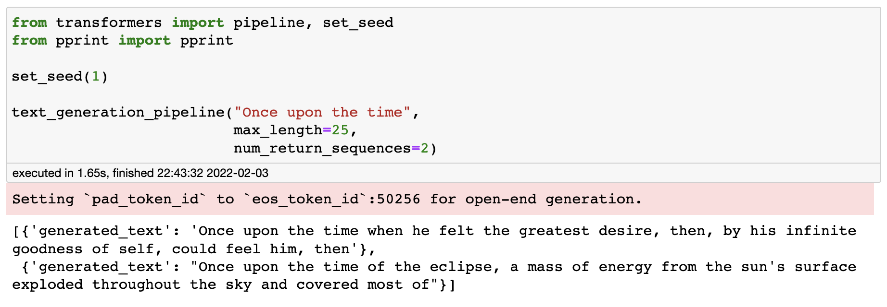

# Transformers NLP demo
### Exploring common NLP tasks using state-of-the-art models from HuggingFace repository

Example:



Preview, modify and extend all examples running interactive jupyter notebook.

## Prerequisites
1. python >=3.8

## Installation

Create and activate virtual environment
```bash
python3 -m venv venv 
source venv/bin/activate
```
Install dependencies
```bash
pip3 install -r requirements.txt
```


### Run
```bash
python3 -m jupyter notebook
```
